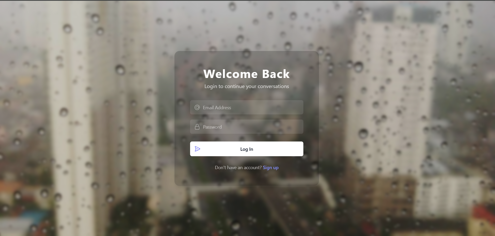
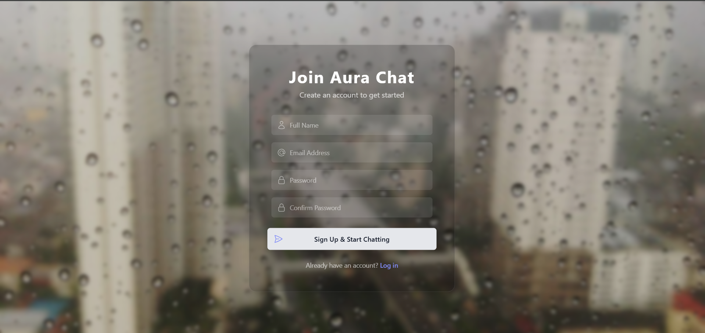
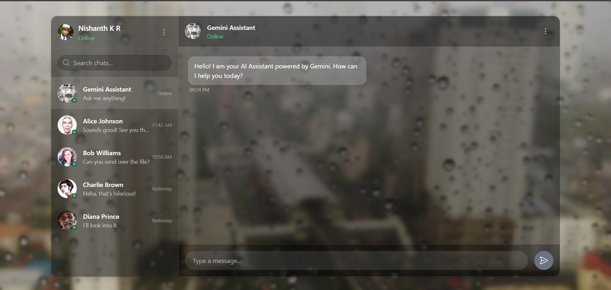

# ✨ Aura Chat

A sleek, modern chat application built with Next.js, Tailwind CSS, and TypeScript, powered by the Google Gemini API.

## 📸 Screenshots

| Login Screen | Sign Up Screen | Chat Interface |
| :---: | :---: | :---: |
|  |  |  |

---

## 🚀 Features

* **User Authentication:** Secure sign-up and login pages.
* **AI Conversations:** Integrated with the **Google Gemini API** for intelligent, real-time responses.
* **Modern UI:** A beautiful "glassmorphism" design built with **Tailwind CSS**.
* **Type-Safe:** Fully written in **TypeScript** for better developer experience and fewer bugs.
* **Responsive:** Looks great on both desktop and mobile devices.

---

## 💻 Tech Stack

* **Framework:** [Next.js](https://nextjs.org/)
* **Language:** [TypeScript](https://www.typescriptlang.org/)
* **Styling:** [Tailwind CSS](https://tailwindcss.com/)
* **AI Model:** [Google Gemini API](https://ai.google.dev/)
* **Authentication:** *(e.g., NextAuth.js, Firebase Auth, Supabase Auth - Add your auth solution here)*
* **Database:** *(e.g., PostgreSQL, MongoDB, Firebase Firestore - Add your database here)*

---

## 🛠️ Getting Started

Follow these instructions to get a local copy up and running.

### Prerequisites

* Node.js (v18 or later)
* `npm`, `yarn`, or `pnpm`
* A Google Gemini API Key (get one from [Google AI Studio](https://ai.google.dev/))

### Installation

1.  **Clone the repository:**
    ```sh
    git clone [https://github.com/your-username/aura-chat.git](https://github.com/your-username/aura-chat.git)
    cd aura-chat
    ```

2.  **Install dependencies:**
    ```sh
    npm install
    # or
    yarn install
    # or
    pnpm install
    ```

3.  **Set up environment variables:**
    Create a file named `.env.local` in the root of your project and add the following variables.
    ```sh
    cp .env.example .env.local
    ```

4.  **Run the development server:**
    ```sh
    npm run dev
    ```
    Open [http://localhost:3000](http://localhost:3000) with your browser to see the result.

---

## 🔑 Environment Variables

To run this project, you will need to add the following environment variables to your `.env.local` file:

```dotenv
# Google Gemini API Key
GEMINI_API_KEY=YOUR_GEMINI_API_KEY_HERE

# Add your database connection string
# DATABASE_URL=...

# Add your authentication secrets (e.g., NextAuth)
# NEXTAUTH_URL=http://localhost:3000
# NEXTAUTH_SECRET=...